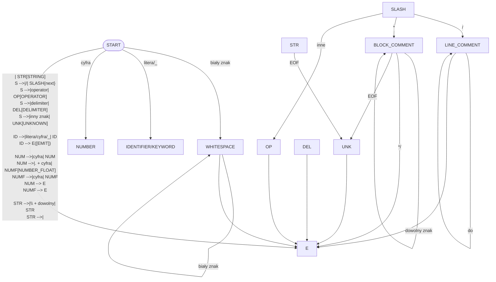

# Skaner i kolorowanie składni (HTML)

Projekt implementuje skaner (lexer) dla uproszczonego języka programowania i generuje pokolorowany kod jako plik HTML.

## Założony format wejściowy

Uproszczony język C-podobny:
- słowa kluczowe: `if`, `else`, `while`, `for`, `return`, `int`, `float`, `bool`, `true`, `false`, `void`, `function`, `var`
- identyfikatory: litera lub `_`, dalej litery/cyfry/`_`
- liczby: całkowite i zmiennoprzecinkowe (np. `12`, `3.14`)
- napisy: cudzysłowy `"..."`, obsługa sekwencji `\`
- komentarze: `// ...` oraz `/* ... */`
- operatory: `+ - * / % = == != < <= > >= && || !`
- delimitery: `() {} [] ; , . :`

## Tabela tokenów

| Token | Opis | Przykłady |
|---|---|---|
| `KEYWORD` | słowa kluczowe języka | `if`, `return`, `int` |
| `IDENTIFIER` | nazwy zmiennych/funkcji | `x`, `licznik_1`, `main` |
| `NUMBER` | liczby całkowite i float | `42`, `10.5` |
| `STRING` | literały tekstowe | `"Ala ma kota"` |
| `COMMENT` | komentarze jedno- i wieloliniowe | `// opis`, `/* opis */` |
| `OPERATOR` | operatory arytm./log./por. | `+`, `==`, `&&`, `!` |
| `DELIMITER` | nawiasy i separatory | `(`, `)`, `{`, `;`, `,` |
| `WHITESPACE` | białe znaki (zachowanie układu) | spacja, tab, nowa linia |
| `UNKNOWN` | nieznany znak/niezamknięty token | np. samotny znak spoza alfabetu |

## Diagram przejść (DFA, uproszczony)



## Działanie programu

Program:
1. wczytuje cały plik wejściowy,
2. tokenizuje tekst zgodnie z tabelą tokenów,
3. zapisuje wynik do pliku HTML,
4. zachowuje układ tekstu z wejścia (spacje/taby/nowe linie) przez render w `<pre>`.

## Uruchomienie

Po zbudowaniu uruchom:

```bash
./build/Debug/skaner.exe <plik_wejsciowy> <plik_wyjsciowy_html>
```

Przykład:

```bash
./build/Debug/skaner.exe input.txt output.html
```

Następnie otwórz `output.html` w przeglądarce.