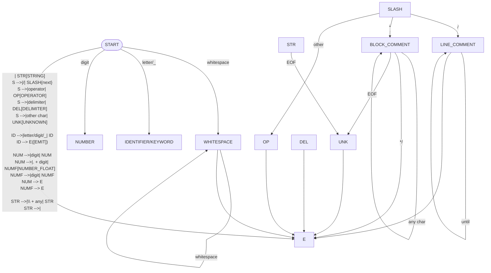

# Scanner and Syntax Highlighting (HTML)

This project implements a scanner (lexer) for a simplified programming language and generates highlighted code as an HTML file.

## Assumed Input Format

A simplified C-like language:
- **Keywords:** `if`, `else`, `while`, `for`, `return`, `int`, `float`, `bool`, `true`, `false`, `void`, `function`, `var`
- **Identifiers:** a letter or `_`, followed by letters/digits/`_`
- **Numbers:** integers and floating-point (e.g., `12`, `3.14`)
- **Strings:** double quotes `"..."`, supports escape sequences `\`
- **Comments:** `// ...` and `/* ... */`
- **Operators:** `+ - * / % = == != < <= > >= && || !`
- **Delimiters:** `() {} [] ; , . :`

## Token Table

| Token | Description | Examples |
|---|---|---|
| `KEYWORD` | Reserved language keywords | `if`, `return`, `int` |
| `IDENTIFIER` | Variable/function names | `x`, `counter_1`, `main` |
| `NUMBER` | Integers and floats | `42`, `10.5` |
| `STRING` | Text literals | `"Hello world"` |
| `COMMENT` | Single and multi-line comments | `// desc`, `/* desc */` |
| `OPERATOR` | Arithm./log./comp. operators | `+`, `==`, `&&`, `!` |
| `DELIMITER` | Brackets and separators | `(`, `)`, `{`, `;`, `,` |
| `WHITESPACE` | White characters (layout preservation) | space, tab, newline |
| `UNKNOWN` | Unrecognized char/unclosed token | e.g., stray character |

## State Transition Diagram (Simplified DFA)


# How It Works
## The Program:
1. Reads the entire input file. 
2. Tokenizes the text according to the token table. 
3. Generates HTML with syntax highlighting. 
4. Preserves the original text layout (spaces/tabs/newlines) using the  tag.

## Color Scheme
1. Keywords: Blue (#569cd6, bold)
2. Identifiers: Light Blue (#9cdcfe)
3. Numbers: Light Green (#b5cea8)
4. Strings: Orange (#ce9178)
5. Comments: Green (#6a9955, italic)
6. Operators: Light Gray (#d4d4d4)
7. Delimiters: Yellow (#dcdcaa)
8. Unknown tokens: Red (#f44747, underlined)

# Building and Running
- Using CMake (From the project root directory):
```
mkdir build
cd build
cmake ../skaner
make
./skaner <input_file> <output_html_file>
```
- Direct Compilation (From the skaner/ directory):
```bash
cd skaner
g++ -std=c++20 -o skaner main.cpp
./skaner <input_file> <output_html_file>
```
- Example Usage:
```
./skaner example.cpp output.html
```  